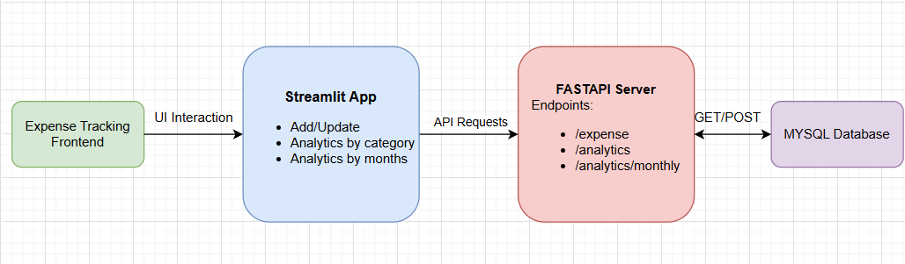

# Expense Management System
An Expense Tracking System built using FastAPI (backend) and Streamlit (frontend) that allows users to add, view, and analyze their expenses by category and month. The project includes a RESTful API for handling data operations and a web interface for user interaction.
## Project Structure
```plaintext
expense-tracking-project/
├── backend/
│   ├── db_helper.py               # Database interaction functions
│   ├── logging_setup.py           # Logger configuration
│   ├── server.py                  # FastAPI server and API endpoints
│   └── server.log                 # Log file for server activity
├── frontend/
│   ├── add_update_ui.py           # UI for adding/updating expenses
│   ├── analytics_by_category_ui.py # UI for analytics by category
│   ├── analytics_by_months_ui.py   # UI for analytics by month
│   └── app.py                     # Main Streamlit app to combine all UIs
├── tests/
│   ├── backend/                   # Tests for backend functions
│   ├── frontend/                  # Tests for frontend functions
│   └── conftest.py                # Configuration for testing
├── README.md                      # Project documentation
└── requirements.txt               # Dependencies for the project
```

## Expense Tracking System Workflow


1. **Expense Tracking Frontend (User Interaction):**
The user interacts with the application via the Expense Tracking Frontend. This frontend allows users to perform actions like adding/updating expenses, and viewing analytics.

2. **Streamlit App:**
The frontend is built using Streamlit, which provides a web-based UI with three main features:
Add/Update: Allows users to input expenses with details such as date, amount, category, and notes.
Analytics by Category: Displays a breakdown of expenses by category.
Analytics by Months: Shows monthly summaries of expenses.
Streamlit makes API requests to the backend server when these features are used.

3. **FastAPI Server (Backend):**
The backend server is implemented using FastAPI and handles requests coming from the Streamlit frontend.
The FastAPI server exposes multiple endpoints:
/expense: Used for adding and retrieving expenses for specific dates.
/analytics: Provides a breakdown of expenses by category.
/analytics/monthly: Fetches monthly expense summaries.
FastAPI processes the requests and interacts with the MySQL database to retrieve or store data as needed.

4. **MySQL Database:**
The MySQL Database serves as the data storage layer for the application.
It stores all expense records, including date, category, amount, and notes, which are retrieved by the backend to display analytics and manage data.

## Features
1. **Add/Update Expenses:** Allows users to enter new expenses with categories, dates, and notes.
2. **Analytics by Category:** Visualizes total expenses by category.
3. **Analytics by Month:** Summarizes total expenses by month.

## Setup Instructions

Follow these steps to set up the project environment and run the application.

**Clone the Repository**
```bash
git clone <repository-url>
cd expense-tracking-project
```
**Set Up a Virtual Environment**
```bash
conda create --name expense_tracking_env python=3.8
conda activate expense_tracking_env
```
**Install Dependencies**
```bash
pip install -r requirements.txt
```
**Configure the MySQL Database Connection**
Update the MySQL connection details in db_helper.py to match your MySQL credentials. This will allow the application to connect to your existing database.
```bash
connection = mysql.connector.connect(
    host="localhost",
    user="your_username",
    password="your_password",
    database="expense_manager"
)
```
**Load Existing Dataset**

**Start the FastAPI Backend Server**
```bash
uvicorn backend.server:app --reload
```
**Run the Streamlit Frontend**
```bash
streamlit run frontend/app.py
```
**Access the Application**

Frontend (Streamlit): http://localhost:8501
Use the tabs to add or update expenses, and to view analytics by category or by month.

Backend (FastAPI API): http://localhost:8000
Access the API documentation at http://localhost:8000/docs for testing endpoints.
## Usage
**Add/Update Expenses:**
Go to the "Add/Update" tab to enter new expenses. Provide details such as date, amount, category, and notes.

**View Analytics by Category:**
In the "Analytics By Category" tab, see a breakdown of total expenses by category.

**View Analytics by Month:**
The "Analytics By Months" tab shows the monthly total of expenses with a bar chart visualization.

## Troubleshooting
If you encounter issues:

Ensure the FastAPI server is running on localhost:8000.
Check your MySQL database connection and ensure tables are correctly set up.
Review server logs in server.log for debugging information.